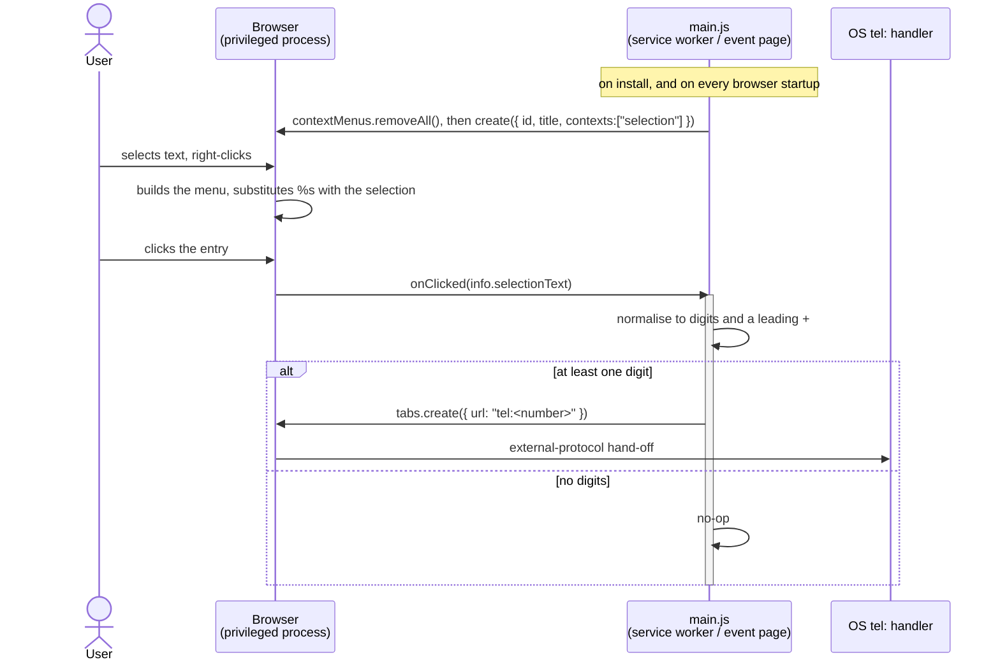

# Architecture

Design record for `chrome-call`. It exists to explain *why* the code looks the way it does,
so that a future change does not silently undo a deliberate decision.

The extension is about 30 lines of logic. Most of the engineering here went into **keeping
it that way** while staying installable, submittable and cross-browser. That trade-off is
the subject of this document.

- [1. Context and constraints](#1-context-and-constraints)
- [2. Runtime model](#2-runtime-model)
- [3. Decision record](#3-decision-record)
- [4. Privacy and threat model](#4-privacy-and-threat-model)
- [5. Failure modes](#5-failure-modes)
- [6. Test strategy](#6-test-strategy)
- [7. Non-goals](#7-non-goals)
- [8. Extending it](#8-extending-it)

## 1. Context and constraints

**Purpose.** Turn a phone number selected on a web page into a placed call, in one
right-click.

The constraints are as important as the purpose, and they are ordered — when two conflict,
the higher one wins:

| # | Constraint | Consequence |
| - | ---------- | ----------- |
| 1 | **Least privilege.** Request the minimum the feature can possibly work with. | No host permissions, no `tabs`, no `storage`. See [ADR-001](#adr-001--no-host-permissions). |
| 2 | **No build step.** Cloning the repo and pointing the browser at it must work. | No bundler, no transpiler, no dependencies. The only tooling is optional and lives in the packaging recipe. |
| 3 | **One package, several browsers.** | A single `manifest.json` serves Chrome and Firefox. See [ADR-003](#adr-003--one-manifest-two-background-keys). |
| 4 | **Minimal footprint.** | Two source files, four icons, two locale catalogs. Every addition has to justify itself. |

## 2. Runtime model

The extension is **event-driven and stateless**. It holds no data, opens no connections, and
between clicks it is not running at all — the browser starts the worker to deliver an event
and terminates it afterwards.

The single most misunderstood part of this design is where the selected text comes from. The
extension never reads the page. The **browser** captures the selection and hands it over as
a field on the click event:

Two things in that diagram are load-bearing:

- **`%s` is substituted by the browser, in the browser process, at menu-display time** — not
  by our code. We store a title containing a literal `%s` and never see the selection until
  the click arrives.
- **The selection crosses the process boundary as data**, on one specific event. There is no
  channel by which the extension could ask for anything else about the page.

## 3. Decision record

### ADR-001 — No host permissions

**Decision.** Declare `contextMenus` and nothing else. No `host_permissions`, no
`content_scripts`, no `tabs`, no `activeTab`.

**Rationale.** The feature needs exactly one piece of information — the text the user
selected — and the `contextMenus` API delivers it in `info.selectionText` without any
permission grant. Reading the page would be a strictly larger capability for no functional
gain. `tabs.create()` likewise needs no permission; the `tabs` permission only unlocks
*reading* privileged tab properties (`url`, `title`, `favIconUrl`), which this code never does.

**Consequence.** The browser reports the extension as having **no site access**, and store
listings show no data-access warning. This is the intended outcome and a feature, not a
misconfiguration — it is what makes the store's "no data collected" declaration accurate.
Anyone tempted to add `host_permissions` to "read the page properly" should stop: it would
enlarge the install prompt, trigger deeper store review, and buy nothing.

### ADR-002 — Register the menu on both install and startup

**Decision.** Call `contextMenus.removeAll()` followed by `create()` from **both**
`runtime.onInstalled` and `runtime.onStartup`.

**Rationale.** Three constraints intersect:

1. Under MV3 the worker is ephemeral, so top-level `create()` would run on every wake and
   risk duplicate entries. Registration must be tied to lifecycle events.
2. Context menus are *persisted* by the browser, so `onInstalled` alone leaves a menu whose
   title was frozen at install time. If the user changes their browser language, the entry
   keeps the old language forever.
3. `create()` with an existing id fails, so re-registration must be idempotent — hence
   `removeAll()` first.

**Consequence.** The title tracks the browser's UI language across restarts. `onClicked` is
registered at **top level** on purpose: it must be attached synchronously as the worker
starts, before any async work, or a click that wakes the worker can be missed.

### ADR-003 — One manifest, two background keys

**Decision.** Declare both `background.service_worker` (Chrome) and `background.scripts`
(Firefox) in a single manifest, and set `browser_specific_settings.gecko`.

**Rationale.** Firefox has not shipped background service workers; it runs an event page
from `scripts`. Declaring both is Mozilla's documented cross-browser pattern — each engine
reads only the key it implements, and `main.js` is shared byte-for-byte. The alternative,
two hand-maintained manifests, invites drift between them.

**Consequence and floors.** `strict_min_version` is **121.0**, not 109 (when Firefox gained
MV3): Firefox 109–120 install this manifest shape but **silently never start the background
script**, which presents as an extension that installs cleanly and does nothing. Chrome's
floor is also 121, since earlier versions refused an MV3 manifest containing
`background.scripts` outright. `gecko.id` is mandatory for MV3 signing — AMO will not assign
one.

Chrome emits one non-fatal warning about the ignored `scripts` key. The packaging recipe in
[PUBLISHING.md](PUBLISHING.md) strips the Firefox-only keys from the Chrome ZIP, from the
same single source manifest, which removes the warning and sidesteps the one open question
about how the Web Store's upload validator treats that key.

### ADR-004 — Normalise to digits and a leading `+`

**Decision.** Reduce the selection to `[0-9+]`, discarding everything else, rather than
preserving `-`, `.`, `(`, `)` as RFC 3966 visual separators.

**Rationale.** A first implementation kept those separators, since `tel:` permits them. It
had a real defect: punctuation from *surrounding label text* survived into the number. A
selection of `Tél. +41 21 123 45 67` produced `tel:.+41211234567` — a stray leading dot.
Because separators are legal in a number *and* common in adjacent prose, a whitelist cannot
distinguish them. Discarding them entirely removes the ambiguity, and dialers normalise
anyway, so nothing is lost.

**Consequence.** Selections tolerate arbitrary labels and trailing notes:
`021 123 45 67 (bureau)` dials correctly. Output is canonical regardless of the source
formatting.

### ADR-005 — Strip `(0)` only for international numbers

**Decision.** Remove the literal `(0)` sequence only when the selection contains `+`.

**Rationale.** `+41 (0)21` is the convention for "dial the 0 domestically, omit it from
abroad". Since the output is an international number, the trunk prefix must go. But a
domestic `(0)21 123 45 67` needs its leading zero *kept*. The `+` is the signal that
distinguishes the two cases.

**Consequence.** Ordering matters and is easy to break: `(0)` must be removed **before** the
[ADR-004](#adr-004--normalise-to-digits-and-a-leading-) reduction, because that step deletes
the parentheses which carry the meaning. Reversing the two lines yields `+410211234567` — a
wrong, dialable number, which is worse than an error. This is covered by a test.

### ADR-006 — Localisation via `_locales`, with a runtime fallback

**Decision.** Interface strings live in `_locales/{en,fr}/messages.json` with
`default_locale: "en"`. The menu title keeps a **literal `%s`**, and the lookup is guarded:
`chrome.i18n.getMessage("menuTitle") || "Call %s"`.

**Rationale — three separate points.**

*Why the guard.* `getMessage()` returns `""` for a missing or misspelled key, and an empty
title makes `create()` fail outright. A one-character typo in a message name would produce
an extension that loads perfectly cleanly with **no menu entry at all**, reporting the error
only to the worker console. The fallback degrades that to "untranslated but working".

*Why a literal `%s` and not an i18n placeholder.* The `$SEL$`/`placeholders` form produces an
identical output string while adding two new ways to fail (a dropped `content` hard-errors
the whole catalog; a mistyped name yields an empty title). The two substitution systems
cannot collide: i18n owns `$…$` exclusively and never inspects `%`, and `%s` is replaced
later, in a different process.

*Why a single `fr` folder.* Chromium strips the region when resolving catalogs
(`fr_CH` → `fr`), and Chrome ships no `fr-CH` UI locale at all — its only French locales are
`fr` and `fr-CA`. So every French variant, Swiss French included, reaches `_locales/fr`.
Adding `fr_FR` or `fr_CH` would fragment the catalog into files to keep in sync for zero
reachable benefit.

**Consequence.** Catalogs are **merged, not chosen**: a key absent from `fr` silently renders
the English string. Partial translations are therefore fine, but a typo'd key name is easy
to miss. Constraints on translators are documented in each catalog's `description` fields
and in the README.

### ADR-007 — `icon.svg` is the source of truth

**Decision.** Keep one vector source and render the PNGs from it, rather than maintaining
hand-made bitmaps.

**Rationale.** The store requires a 128×128 icon; the previous icon set topped out at 64 and
could not be submitted at all. Rendering from vector makes any required size exact and
lossless. The glyph is also *coloured* rather than pure black: the previous transparent black
line art disappeared against dark backgrounds in the extension manager and store UI.

**Consequence.** `icon.svg` is a build input, not a runtime asset — no manifest key
references it, and the packaging recipe excludes it from the ZIP.

### ADR-008 — No persistence, no network

**Decision.** No `storage` permission, no `fetch`, no analytics, no remote code.

**Rationale.** Nothing in the feature requires remembering anything between clicks. State is
a liability: it creates a privacy story to explain, a data-usage declaration to defend, and
a migration burden.

**Consequence.** The store's "no data collected" declaration is accurate by construction
rather than by promise, and remains verifiable by reading 30 lines.

## 4. Privacy and threat model

**What the extension can observe.** The text of one selection, at the instant the user
clicks the menu entry. Nothing else, at no other time.

**What it cannot observe**, and not as a matter of policy but because no API is reachable
without permissions it does not hold: page content or DOM, page URLs, other tabs, browsing
history, cookies, form data, or anything at all while the user is not clicking its menu
entry.

**Untrusted input.** There is exactly one: `info.selectionText`, which is attacker-influenced
whenever a page can control the text a user selects. It is handled as follows:

- It is reduced to `[0-9+]` before use, so no character with meaning in any other context
  survives.
- It is concatenated onto a **fixed `"tel:"` prefix**. The scheme is therefore not
  attacker-reachable: the resulting URL always starts with `tel:`, so a crafted selection
  cannot escalate into `javascript:`, `data:`, `file:` or any other scheme. This property
  depends on the prefix being a literal — building the URL from any page-supplied portion of
  the scheme would break it.
- It is never evaluated, never inserted into a DOM, never logged, never transmitted.

**Residual exposure.** A malicious page could make a user dial a number of the page's
choosing by disguising it as another number. This is inherent to any click-to-call feature,
requires deliberate user action on visible text, and is not mitigable in the extension. It is
no worse than a page rendering an ordinary `<a href="tel:">` link.

## 5. Failure modes

Known ways this breaks, kept here so they are diagnosed in minutes rather than rediscovered.

| Symptom | Cause | Status |
| ------- | ----- | ------ |
| Installs cleanly, **no menu entry at all** | Empty title from a missing i18n key rejecting `create()` | Mitigated ([ADR-006](#adr-006--localisation-via-_locales-with-a-runtime-fallback)); regression test |
| Installs cleanly, no menu, **Firefox 109–120** | Background script never starts with both background keys present | Mitigated by `strict_min_version: 121.0` |
| Menu entry **visible but does nothing** | Worker terminated and not revived (reported on Brave, `brave-browser` #45338) | Not reproduced; `onClicked` registered synchronously at top level is the available mitigation |
| Menu title stuck in the **wrong language** | Menu persisted from install, browser language changed since | Mitigated by re-registering on `onStartup` ([ADR-002](#adr-002--register-the-menu-on-both-install-and-startup)) |
| **Nothing happens** on click | No OS handler registered for `tel:` | By design — documented in the README's troubleshooting note |
| Extra confirmation prompt before dialling | `tel:` is not on Chromium's external-protocol allowlist (only `mailto:` is) | Expected browser behaviour, not a defect |
| Duplicate menu entries | `create()` called without `removeAll()`, or at top level | Prevented by [ADR-002](#adr-002--register-the-menu-on-both-install-and-startup); regression test |
| Wrong number dialled for `+41 (0)21 …` | `(0)` stripped after, not before, normalisation | Prevented by ordering in [ADR-005](#adr-005--strip-0-only-for-international-numbers); regression test |
| Locale folder ignored entirely | Hyphenated folder name (`fr-CH`) — passes validation, is never loaded | Avoided by using `en`/`fr`; documented for contributors |

**Open, and not verifiable without real hardware:** whether `tabs.create()` leaves a stray
`about:blank` tab after the protocol hand-off, and the exact behaviour when no `tel:` handler
is registered. Both are tracked in [PUBLISHING.md](PUBLISHING.md). If the stray tab is real,
the fix is to capture the tab id from `tabs.create()` and close it after hand-off.

## 6. Test strategy

Three tiers, each proving something the others cannot. No test framework and no dependencies
beyond a headless Chromium.

| Tier | Method | What it proves |
| ---- | ------ | -------------- |
| **Logic** | Loads the real `main.js` against a mocked `chrome` global; asserts listener registration, menu idempotence, and the full number-normalisation table | The transformation rules, including every case in the README table and the empty-title regression |
| **Integration** | Loads the unpacked extension into headless Chromium under several `--lang` values; reads back the manifest as the browser parsed it, fetches every declared icon, and probes menu registration via the duplicate-id error | That the browser *accepts* what we wrote: manifest valid, icons present at declared sizes, localisation resolving, menu genuinely created |
| **Artifact** | Builds the ZIPs with the documented packaging recipe, unzips, and runs the integration tier against the result | That the thing actually shipped works — catching packaging mistakes (missing files, over-eager exclusions) that never appear when testing the working tree |

Two deliberate choices. Menu *registration* is verified indirectly, by creating a duplicate
id and asserting the resulting error, because native context menus are OS-level UI that
cannot be driven from page automation. And the artifact tier exists because testing the
working tree cannot catch a packaging error — the most likely way to ship something broken.

**Not covered by automation:** the `tel:` hand-off itself, and Firefox (no Firefox binary in
the test environment). Both are manual, and listed in [PUBLISHING.md](PUBLISHING.md).

## 7. Non-goals

Stated so they are not re-litigated, and so a future contributor understands these are
declined on purpose rather than merely absent.

- **Detecting numbers automatically in the page.** Would require host permissions and a
  content script, inverting [ADR-001](#adr-001--no-host-permissions) — the single most
  valuable property of the design — to save one selection gesture.
- **A toolbar button, popup or options page.** There is nothing to configure. Behaviour is
  fully determined by the selection.
- **Call history, favourites, or any stored state.** See
  [ADR-008](#adr-008--no-persistence-no-network).
- **Full E.164 validation or region inference.** Would need a phone-number library, dwarfing
  the extension and second-guessing what the user selected. The OS dialer is the better
  judge.
- **Mobile.** `menus.create` is unsupported on Firefox for Android and Safari iOS.

## 8. Extending it

**Adding a language.** Copy `_locales/en/messages.json` to `_locales/<code>/messages.json`
and translate the three `message` values. Use underscores in regional codes (`pt_BR`, never
`pt-BR`). Keep exactly one `%s` in `menuTitle` — it cannot be escaped, so any word where `s`
follows a percent sign will break substitution — and write `&&` for a literal ampersand.

**Changing the parsing rules.** Preserve the ordering in
[ADR-005](#adr-005--strip-0-only-for-international-numbers) and extend the case table in the
logic tier in the same commit. The table is the specification; the README's table is
generated from the same cases and must stay in agreement.

**Adding a permission.** Treat this as an architectural change, not a detail. Read
[ADR-001](#adr-001--no-host-permissions) first, and update the per-permission justification
in [PUBLISHING.md](PUBLISHING.md) — the store requires a written justification for every
declared permission.

**Adding a menu context.** `contexts` is deliberately `["selection"]` only. Chrome substitutes
`%s` unconditionally for every entry, so in a context with no selection the title renders with
a dangling gap; Firefox instead shows a literal `%s`. Both need a separate title per context.
